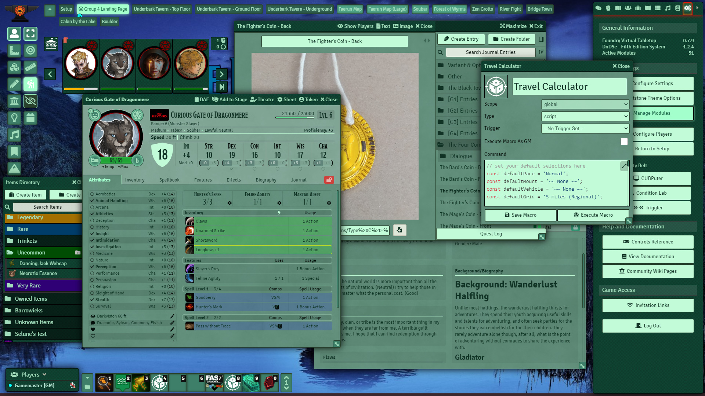

[![foundry-shield-079]][foundry-url]
[![Forks][forks-shield]][forks-url]
[![Stargazers][stars-shield]][stars-url]
[![Issues][issues-shield]][issues-url]

 

  
  <h3 align="center">Spearmint - A Whetstone Theme</h3>
  

    A module stub for authors looking to create a Whetstone theme.
  

  

    This module is intended as a starting point for one's own custom theme, you may copy, share, modify, and use this code as you see fit.
  

  

     
    <a href="https://github.com/MajorVictory/Whetstone/wiki/Whetstone:-FoundryVTT-Theme-Manager">Read the Whetstone Wiki</a> | <a href="https://github.com/MajorVictory/Whetstone-Spearmint/issues">Report Bugs / Request Features</a>
  

## Changelog

[Previous Versions Changelog](CHANGELOG.md)

[foundry-shield-079]: https://img.shields.io/badge/Foundry-v0.7.9-informational
[foundry-url]: https://foundryvtt.com/
[forks-shield]: https://img.shields.io/github/forks/MajorVictory/Whetstone-Spearmint.svg?style=flat-square
[forks-url]: https://github.com/MajorVictory/Whetstone-Spearmint/network/members
[stars-shield]: https://img.shields.io/github/stars/MajorVictory/Whetstone-Spearmint.svg?style=flat-square
[stars-url]: https://github.com/MajorVictory/Whetstone-Spearmint/stargazers
[issues-shield]: https://img.shields.io/github/issues/MajorVictory/Whetstone-Spearmint.svg?style=flat-square
[issues-url]: https://github.com/MajorVictory/Whetstone-Spearmint/issues
